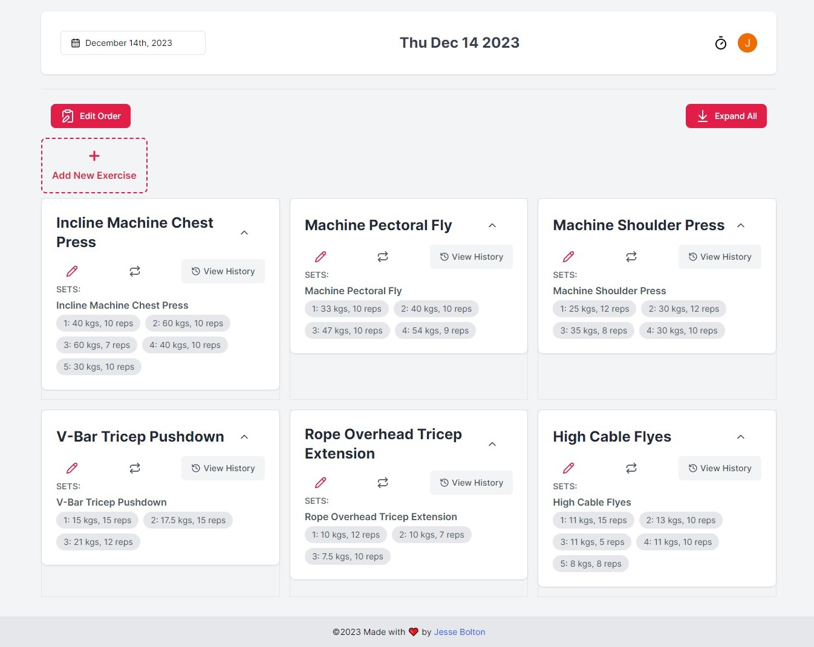

# Full Stack Workout Tracker

## Features
- **Secure User Authentication** 🔐 - Utilizing Clerk.js for a smooth and secure sign-in process.
- **Customizable Workouts** 🏋️ - Tailor exercises based on specific body parts and intensity levels.
- **Dynamic Exercise Logging** 📝 - Add, update, or remove exercises and reps with ease.
- **Progress Tracking** 📊 - Visualize workout trends and improvements with informative charts.
- **Drag-and-Drop Interface** 🖱️ - Plan exercises with an intuitive drag-and-drop interface.
- **Responsive Design** 📱 - Ensures a consistent and engaging user experience across all devices.

## Technical Skills
| Technology | Use in Project |
|------------|----------------|
| React      | Frontend Development |
| TypeScript | Type-Safety & Better Code Quality |
| Next.js 13 | Server-Side Rendering |
| Drizzle ORM| Database Management |

## Live Deployment

Check out the live version: [Try the App Here](https://gains-six.vercel.app/)

## Screenshots

